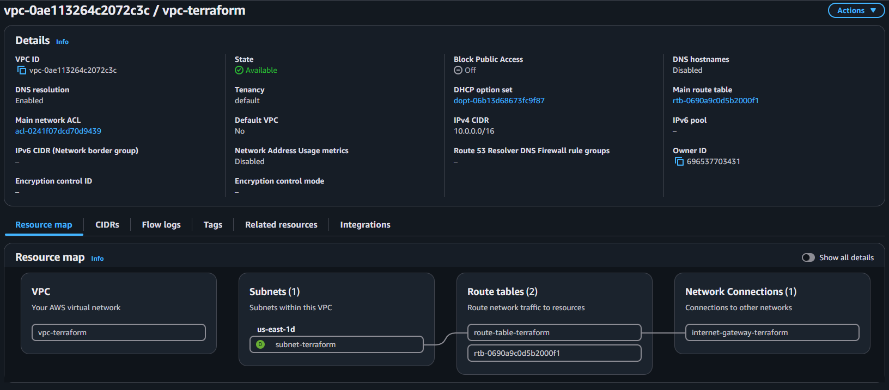
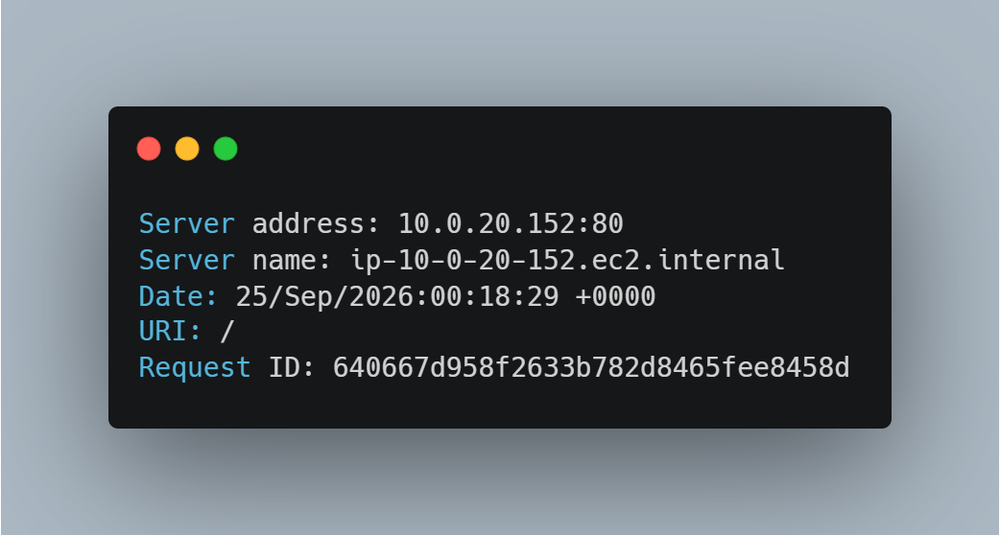
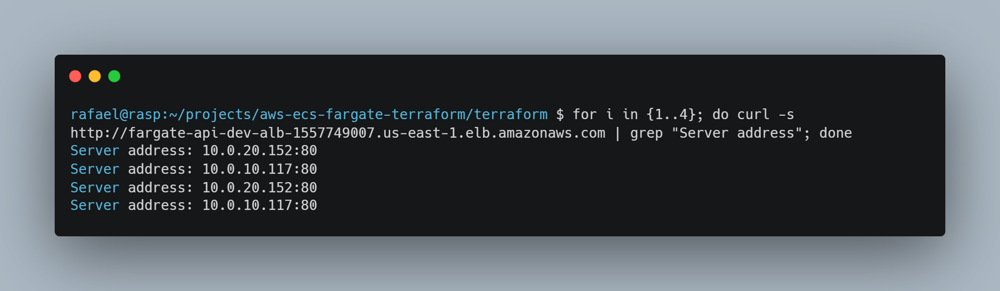
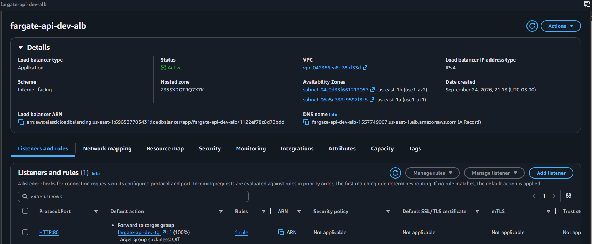
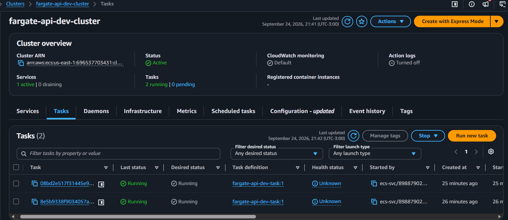
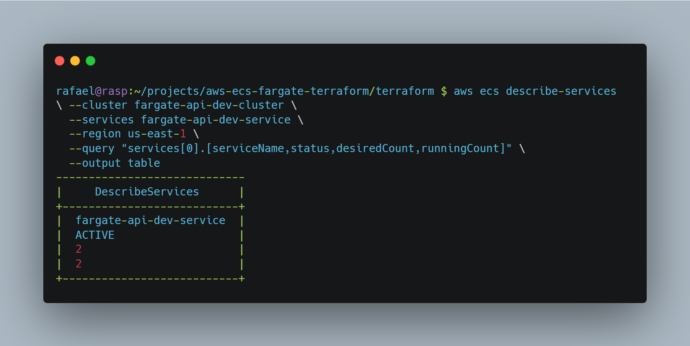
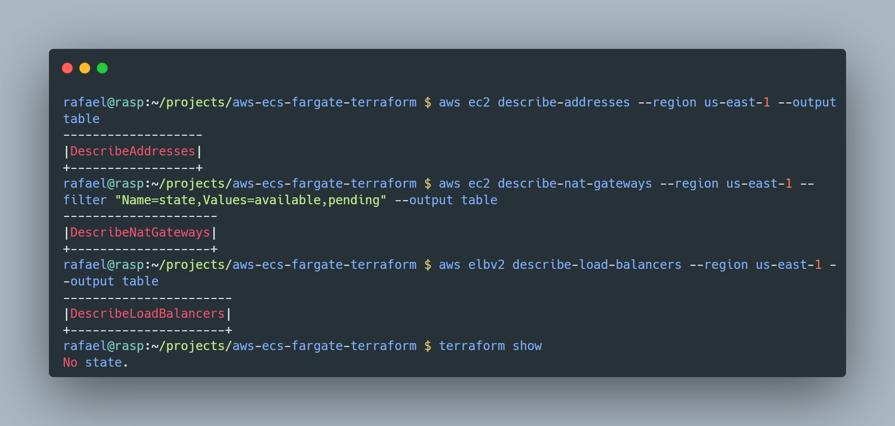

# AWS ECS Fargate Infrastructure with Terraform

Infraestrutura como Código (IaC) modular e resiliente provisionada na AWS utilizando Terraform. O projeto implementa uma API conteinerizada em Python rodando em **Amazon ECS Fargate** distribuído em alta disponibilidade, isolado em subnets privadas e acessível externamente via **Application Load Balancer (ALB)**.

---

## 📌 Visão Geral da Arquitetura

A arquitetura foi desenhada seguindo as melhores práticas do *AWS Well-Architected Framework*, com foco em isolamento de rede, alta disponibilidade e controle de tráfego:

* **VPC Customizada:** Segmentada em subnets públicas e privadas distribuídas estrategicamente em duas Zonas de Disponibilidade (`us-east-1a` e `us-east-1b`) para garantir tolerância a falhas.
* **Segurança e Isolamento Privado:** As tarefas do ECS Fargate executam exclusivamente nas subnets privadas, sem endereços IPv4 públicos atribuídos diretamente às interfaces de rede elásticas (ENIs).
* **Conectividade de Saída Segura:** Um NAT Gateway alocado na subnet pública (associado a um Elastic IP dedicado) viabiliza a saída segura para a internet, permitindo que os containers privados realizem o download de pacotes e dependências sem expor portas para conexões de entrada.
* **Balanceamento de Carga e Roteamento de Entrada:** O Application Load Balancer (ALB) público atua como ponto único de entrada na borda, recebendo o tráfego HTTP na porta 80 e distribuindo as requisições entre as tarefas ativas no Target Group via algoritmo Round-Robin.
* **Grupos de Segurança em Camadas (Security Groups):** O Security Group do ALB permite conexões públicas na porta 80, enquanto o Security Group do ECS restringe o tráfego de entrada exclusivamente à origem do ALB na porta da aplicação.
* **Observabilidade e Logs:** Centralização de registros e logs de execução dos containers gerenciada nativamente no Amazon CloudWatch Logs.



---

## 🚀 Tecnologias e Serviços Utilizados

* **Terraform:** Provisionamento declarativo e ciclo de vida de ponta a ponta de 25 recursos.
* **Amazon ECS (AWS Fargate):** Orquestração e computação serverless para containers Docker.
* **Application Load Balancer (ALB):** Roteamento em camada de aplicação (Camada 7) com health checks automáticos.
* **Amazon VPC & Networking:** VPC dedicada, Internet Gateway, NAT Gateway, Elastic IP, Subnets Públicas/Privadas e Tabelas de Roteamento segregadas.
* **Amazon CloudWatch:** Armazenamento, retenção e consulta de logs da aplicação.
* **Python / Docker:** Microsserviço containerizado para testes de requisições e validação de balanceamento.

---

## 📸 Validação da Infraestrutura e Evidências

### 1. Balanceamento de Carga e Alta Disponibilidade (Round-Robin)
O Application Load Balancer distribui as requisições de forma balanceada entre os containers ativos nas diferentes zonas de disponibilidade:




### 2. Application Load Balancer e Target Groups
Configuração ativa do balanceador de carga público roteando tráfego saudável para os containers internos:



### 3. Orquestração e Saúde dos Containers (Amazon ECS)
Tarefas Fargate ativas, em execução contínua com IPs privados e monitoramento de status:




---

## 📖 Trilha de Implementação (Passo a Passo Detalhado)

O processo completo de construção, configuração, validação e desprovisionamento foi documentado detalhadamente na pasta [`docs/`](docs/):

1. **[Arquitetura da Solução](docs/01-architecture.md)** — Desenho técnico e decisões de infraestrutura.
2. **[Desenvolvimento da Aplicação](docs/02-desenvolvimento-app.md)** — Criação da API Python e conteinerização Docker.
3. **[Configuração Base Terraform](docs/03-base.md)** — Setup dos providers e variáveis do Terraform.
4. **[Rede e VPC](docs/04-vpc.md)** — Segmentação de subnets públicas e privadas em multi-AZ.
5. **[Segurança e IAM](docs/05-security.md)** — Definição de Security Groups em camadas e permissões mínimas.
6. **[Application Load Balancer](docs/06-alb.md)** — Configuração do ALB, Target Groups e Health Checks.
7. **[Isolamento via NAT Gateway](docs/07-implementacao-nat-gateway.md)** — Roteamento seguro de saída para as tarefas privadas.
8. **[Validação e Testes](docs/08-validacao-teste.md)** — Testes práticos de Round-Robin e alta disponibilidade.
9. **[Desprovisionamento e Auditoria](docs/09-desprovisionamento-e-auditoria.md)** — Desmontagem automatizado e auditoria anti-cobrança.

## 📂 Estrutura do Repositório

```text
.
├── app/                                    # Código-fonte da aplicação e Dockerfile
│   ├── Dockerfile
│   ├── main.py
│   └── requirements.txt
├── docs/                                   # Documentação técnica detalhada
│   ├── 01-architecture.md
│   ├── 02-desenvolvimento-app.md
│   ├── 03-base.md
│   ├── 04-vpc.md
│   ├── 05-security.md
│   ├── 06-alb.md
│   ├── 07-implementacao-nat-gateway.md
│   ├── 08-validacao-teste.md
│   ├── 09-desprovisionamento-e-auditoria.md
│   └── images/                             # Evidências e capturas de tela do ambiente
│       ├── alb-response-test.png
│       ├── aws-alb-details.png
│       ├── aws-ecs-tasks-running.png
│       ├── aws-vpc-architecture-map.png
│       ├── desprovisionamento-e-auditoria.png
│       ├── ecs-service-status.png
│       └── load-balancer-round-robin.png
├── terraform/                              # Módulos e declarações de IaC
│   ├── alb.tf
│   ├── ecs.tf
│   ├── outputs.tf
│   ├── security.tf
│   ├── variables.tf
│   ├── versions.tf
│   └── vpc.tf
└── README.md
```

---

## 🛠️ Como Reproduzir

### Pré-requisitos
* **AWS CLI** instalado e configurado (`aws configure`).
* **Terraform** instalado (>= 1.5).

### 1. Provisionamento

Clone o repositório e navegue até o diretório do Terraform:

```bash
git clone [https://github.com/SEU_USUARIO/aws-ecs-fargate-terraform.git](https://github.com/SEU_USUARIO/aws-ecs-fargate-terraform.git)
cd aws-ecs-fargate-terraform/terraform
```

Inicialize os providers e módulos:

```bash
terraform init
```

Revise o plano de execução e aplique a infraestrutura:

```bash
terraform apply
```

Ao finalizar, o Terraform exibirá nos outputs o DNS público do Application Load Balancer para testes de acesso.

---

## 🧹 Desprovisionamento e Auditoria de Custos (Zero Waste)

Para garantir que nenhum custo desnecessário permaneça ativo na conta após os testes de validação, a infraestrutura inteira de 25 recursos é destruída de forma automatizada pelo Terraform:

```bash
terraform destroy
```

### Validação de Limpeza via AWS CLI (Garantia de Custo Zero)

Após o término do `destroy`, foi realizada uma auditoria via AWS CLI confirmando a ausência de componentes tarifáveis por hora (Elastic IPs ociosos, NAT Gateways e Load Balancers):

```bash
# 1. Conferir se restou algum Elastic IP (IPv4 público)
aws ec2 describe-addresses --region us-east-1 --output table

# 2. Conferir se restou algum NAT Gateway
aws ec2 describe-nat-gateways --region us-east-1 --filter "Name=state,Values=available,pending" --output table

# 3. Conferir se restou algum Load Balancer
aws elbv2 describe-load-balancers --region us-east-1 --output table

# 4. Validar esvaziamento do arquivo de estado
terraform show
```



Para conferir o passo a passo completo da auditoria e comandos executados, consulte [`docs/09-desprovisionamento-e-auditoria.md`](docs/09-desprovisionamento-e-auditoria.md).